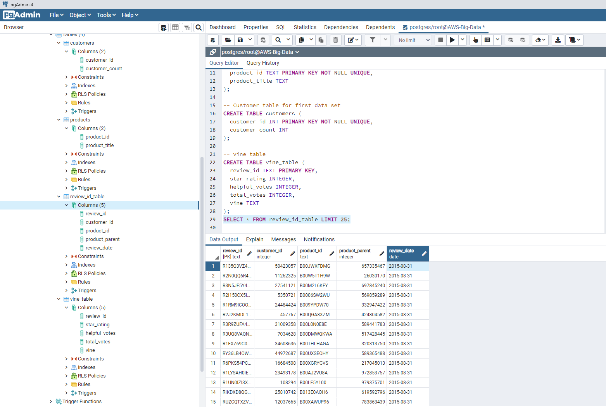

# Big Data: "Alexa, can you handle big data?"

## Objective
Create DataFrames to match production-ready tables from two big Amazon customer review datasets.

## Process
1. The provided SQL schema was used to create tables in the RDS database using pgAdmin

2. The `jewelry.ipynb` and `grocery.ipynb` notebooks were created in Google Colab used to perform ETL on the chosen datasets:
    * The datasets were extracted from[Amazon's S3 buckets of [US Reviews](https://s3.amazonaws.com/amazon-reviews-pds/tsv/index.txt)
    * The datasets were cleaned by dropping NA values and duplicates

    * Finally the datasets were loaded into the RDS database

After dropping N/A values the jewelry and grocery datasets contained 1,767,394 and 2,402,212 records, respectively.

Total, there were 1,069,222 unique customer ids in the jewelry dataset.

## Database
